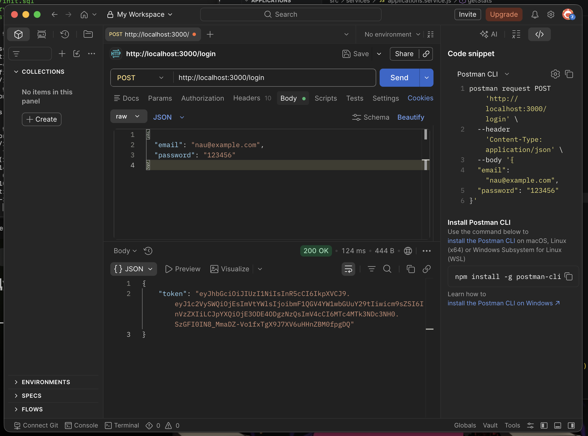
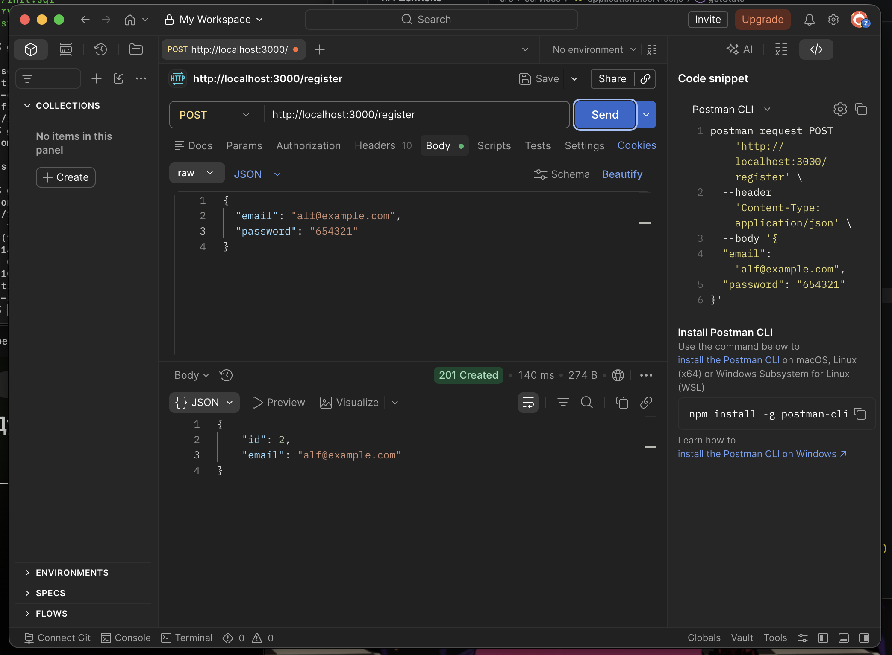
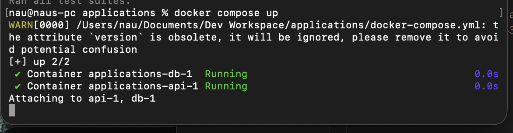
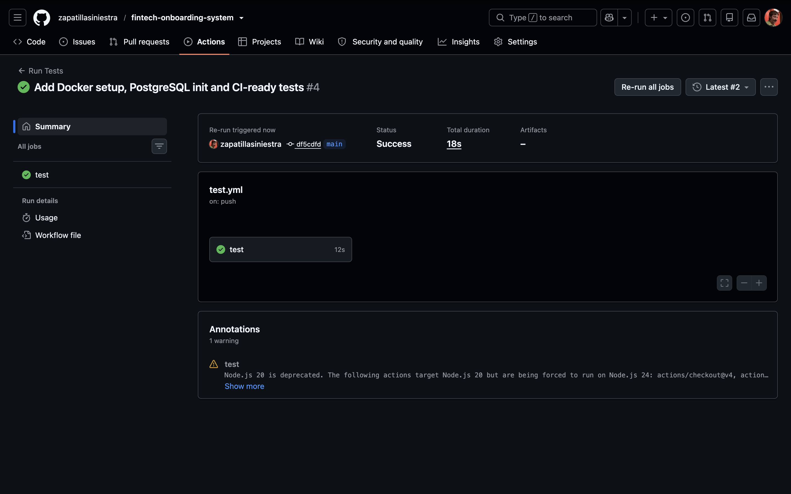

# Tasks API

A REST API built with Node.js, Express, and PostgreSQL, fully containerized with Docker and tested with Jest + CI pipeline.

---

## Features

* User registration & login (JWT authentication)
* Role-based authorization (admin/user)
* Application status workflow (pending → approved/rejected)
* PostgreSQL database integration
* Dockerized environment
* Automated tests (Jest + Supertest)
* CI pipeline with GitHub Actions

---

## Run with Docker

```bash
docker compose up --build
```

API runs on:

```
http://localhost:3000
```

---

## API Endpoints

### Register

```http
POST /register
```

```json
{
  "email": "user@example.com",
  "password": "123456"
}
```

---

### Login

```http
POST /login
```

```json
{
  "email": "user@example.com",
  "password": "123456"
}
```

Response:

```json
{
  "token": "jwt_token"
}
```

---

### Get Applications

```http
GET /applications
```

Requires JWT token:

```
Authorization: Bearer <token>
```

---

### Update Application Status (Admin only)

```http
PATCH /applications/:id/status
```

```json
{
  "status": "approved"
}
```

---

## Run Tests

```bash
npm test
```

Tests run automatically on every push via GitHub Actions.

---

## Database

PostgreSQL runs in Docker and is initialized with:

* users table
* applications table

---

## Architecture

* API container (Node.js)
* Database container (PostgreSQL)
* Shared Docker network

---

## Screenshots

Add screenshots in `/screenshots` folder:

```md




```

---

## Future Improvements

* Swagger documentation
* Pagination & filtering
* Refresh tokens
* Deployment (Render / Railway)
